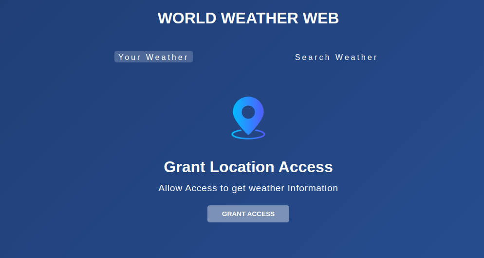
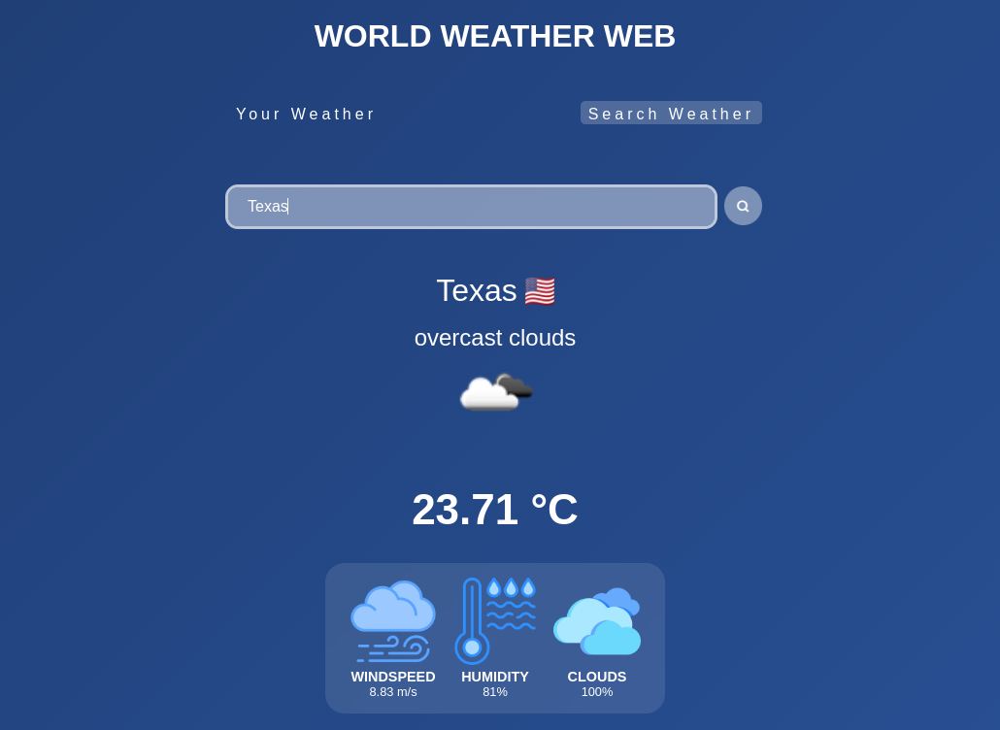
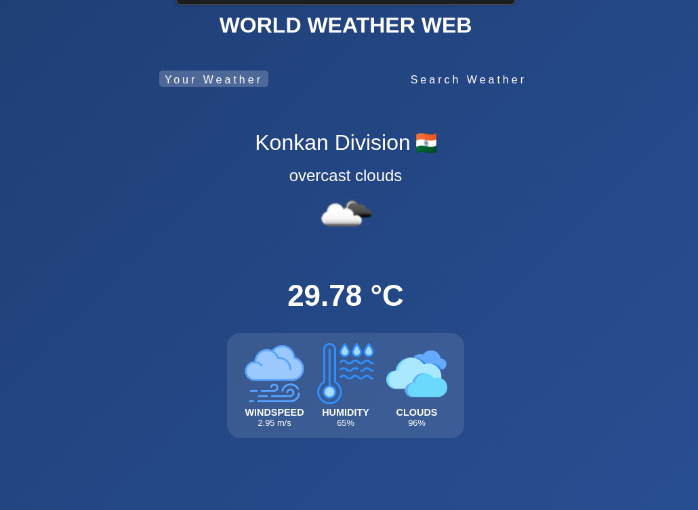

# 🌦️ World Weather Web

### Get real-time weather updates from anywhere in the world with this responsive and user-friendly web app.





# ✨ Features

- ## 🔍 Dual Search Options

- ### Get your local weather with a single click
- ### Search any city globally to check conditions

- ## 🌡️ Comprehensive Weather Data

- ### Current temperature in Celsius
- ### Wind speed measurements
- ### Humidity percentage
- ### Cloud coverage
- ### Visual weather conditions

- ## 🌐 Global Coverage

- ### Country flags displayed with results
- ### Works for cities worldwide

- ## ⚡ Lightning Fast

- ### Instant results via OpenWeather API
- ### Smooth, responsive interface

# 🛠️ Technology Stack

- ### `Vanilla JavaScript` (No frameworks needed!)
- ### `HTML5` & `CSS3`
- ### `OpenWeather API` for real-time weather data
- ### `Geolocation API` for local weather detection
- ### `Session storage` for preserving user preferences


# 🚀 Getting Started
## Prerequisites

- ### Web browser with JavaScript enabled
- ### Internet connection
- ### OpenWeather API key (free tier works perfectly)

## Quick Setup

## 1. Clone this repository

```bash
git clone https://github.com/yourusername/world-weather-web.git

cd world-weather-web
```

## 2. Add your API key

- ### Sign up at OpenWeather to get a free API key
- ### Open app.js and replace the placeholder API key with yours:
```javascript
const API_KEY = "your-api-key-here";
```

### 3. Launch the app

- ### Open index.html in your browser
- ### For the best experience, use a live server


# 📱 User Guide
## Your Weather

- ### Click the "Your Weather" tab
- ### Grant location access when prompted
- ### View your local weather conditions instantly

## Search Weather

- ### Click the "Search Weather" tab
- ### Enter any city name in the search box
- ### Press Enter or click the search icon
- ### View detailed weather information for that location

# 📝 License
### This project is licensed under the MIT License - see the LICENSE file for details.
---


# 🙏 Acknowledgements

- ### Weather data provided by OpenWeather API
- ### Country flags from Flagpedia
- ### Icons from Remix Icon
- ### Images/gif from Pixabay 
--- 
# Made with ❤️ by Darshan Dubey
